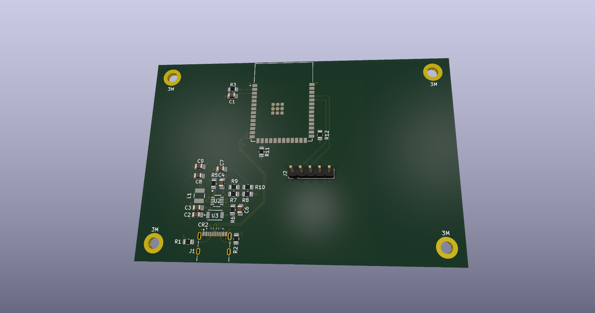
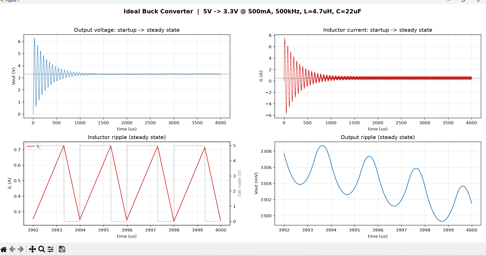

# Human-Presence-sensor

This is my second version of this board. My first board had many errors and was basically unusable. The pin headers were not aligned once i got the boards. This made it impossible to use the esp32 dev board I had. The biggest failure was the fact that i misplaced the USB type C connector. It was not close enough to the edge for me to plug in a power cable. This design puts the ESP32 on the PCB and lets just the mmWave 24Ghz radar board plug into a pin header. This design forced me to learn how to really design a buck converter circuit so i can take the 5V USB input power and drop it down to 3.3V required for the MCU. I took it a step further and I really drilled down on learning the physic's and the equations to derive what you need for a buck converter.

This is the result of my python script running a simulation of my chosen buck converter. I ran several different versions to see if my inductor sizing was correct. The reference design I used for most of my layout turned out to be really good for my given circuit. This is why i chose a 4.7uH inductor for my design. Even though this is my project and my own board I tried to treat it with the same care I will bring to the work place when I get to design other boards. The next big piece of the buck converter was to figure out the feedback sense resistor values required. My converter has a reference voltage of 0.8v. This means the formula I used is
Vout = Vref × (1 + R1/R2).
